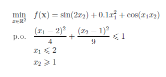
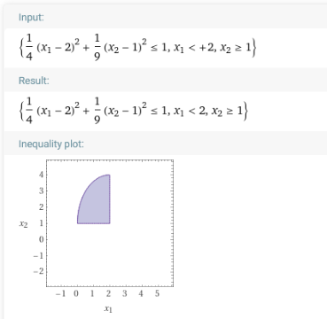
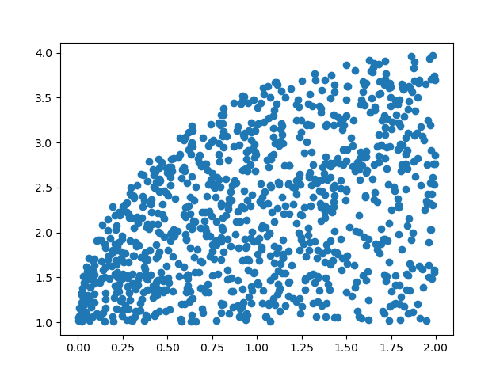
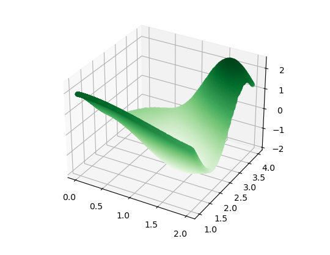

## Zaliczenie labów PRR
## Zadanie 4
**Znajdź globalnie optymalne rozwiązanie danego problemu stosując metodę Monte Carlo**

    1. Program sekwencyjny 
        app_sequentially.py
    2. Impelemntacja za pomocą OpenMP - brak :(  +multiprocessing
        app_process.py
    3. Implementacja za pomocą wątków 
        app_threads.py
    4. Implementacja za pomocą MPI 
        app_mpi.py
        app_mpi_run.py - wymaga bibl. mpi4py i cythona
    5. Implementacja za pomocą jakiegoś mechanizmu RPC 
        app_rpc_server.py
        app_rpc_client.py

---
### Minimalizowana funcja:~~~~
  
  

---
### Przykładowe wyniku
Plik,Data,Czas Wyk [s].,Liczba pkt.,Proc/Thrds,x1,x2,"f(x1,x2)"
Sekwencyjny,07/21 21:38:56,16.7331,1.6e+08,1,1.26990620,2.38995213,-1.8307815122
Threads,07/21 21:39:29,3.7094,1.0e+07,16,1.26989304,2.38996724,-1.8307815107
Processing,07/21 21:40:13,3.8249,1.0e+07,16,1.26994562,2.38999832,-1.8307815136
xml_RPC,07/21 21:40:58,6.0503,1.0e+07,16,1.26991720,2.38995433,-1.8307815148
MPI,07/21 21:42:00,4.0583,1.0e+07,16,1.26996291,2.38993946,-1.8307815166

---
####  Notatki:
    - Szybciej szukać po 10 listach po milion niż jednej liscie 10 milionów
    - Implementacja MPI w pythonie
        https://stackoverflow.com/questions/14004457/dll-load-failed-the-specified-module-could-not-be-found-when-doing-from-mpi4py/57629338#57629338
    - opemMP - cython ? 
    
---

